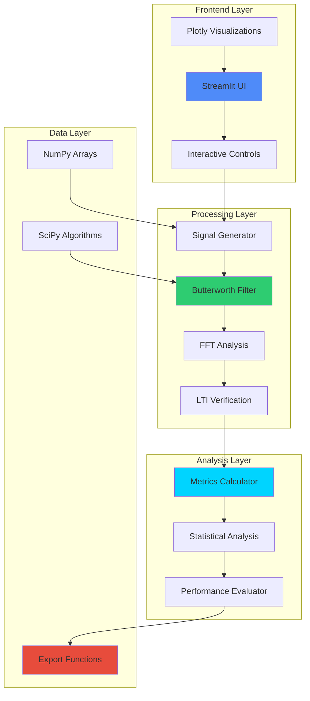
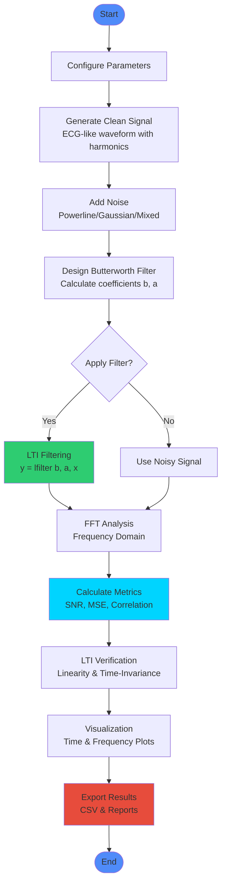
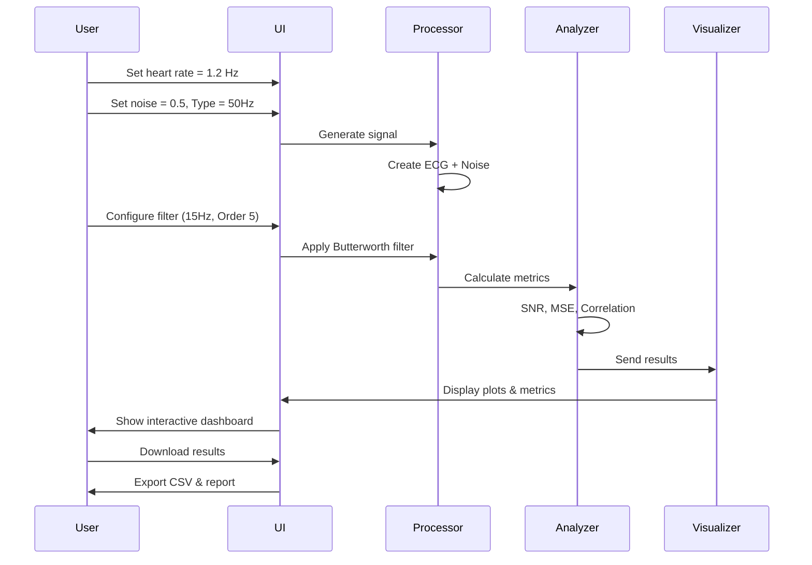

# 🩺 BioSignal LTI Analysis Pro

[](https://biomedical-signal-processing-and-linear-time-invariant-system.streamlit.app/)
[](https://www.python.org/downloads/)
[](https://opensource.org/licenses/MIT)

> **Advanced Biomedical Signal Processing & Linear Time-Invariant (LTI) System Analysis Platform**

An interactive web application for real-time digital signal processing, demonstrating noise removal techniques using Butterworth filters while verifying core DSP principles like linearity and time-invariance.

## 🚀 Live Demo

**[Launch Application →](https://biomedical-signal-processing-and-linear-time-invariant-system.streamlit.app/)**

---

## 📋 Table of Contents

- [Overview](#-overview)
- [Features](#-features)
- [System Architecture](#-system-architecture)
- [Signal Processing Pipeline](#-signal-processing-pipeline)
- [Installation](#-installation)
- [Usage](#-usage)
- [Technical Details](#-technical-details)
- [Applications](#-applications)
- [Screenshots](#-screenshots)
- [Contributing](#-contributing)
- [License](#-license)

---

## 🎯 Overview

This application provides a comprehensive platform for understanding and experimenting with biomedical signal processing techniques. It's designed for:

- 🎓 **Students** learning digital signal processing
- 👨‍🔬 **Researchers** prototyping filter designs
- 🏥 **Biomedical Engineers** analyzing physiological signals
- 👨‍💻 **Developers** building signal processing applications

### Key Capabilities


---

## ✨ Features

### 🎛️ **Signal Generation & Configuration**
- Synthetic ECG-like signal generation with harmonics
- Adjustable heart rate (0.5-3.0 Hz)
- Multiple noise types:
  - 50Hz Powerline interference
  - Gaussian white noise
  - Mixed noise scenarios
- Configurable noise amplitude

### 🔧 **Advanced Filter Design**
- **Butterworth Lowpass Filter** implementation
- Adjustable cutoff frequency (1-60 Hz)
- Variable filter order (1-10) for rolloff control
- Real-time frequency response visualization
- Filter coefficient inspection

### 📊 **Comprehensive Analysis**
- **Time Domain Analysis**
  - Interactive signal comparison
  - Separated signal visualization
  - Reconstruction error analysis
- **Frequency Domain Analysis**
  - FFT spectrum visualization
  - Filter frequency response
  - Noise identification
- **LTI System Verification**
  - Linearity testing (superposition principle)
  - Time-invariance validation
  - Mathematical verification

### 📈 **Performance Metrics**
- Signal-to-Noise Ratio (SNR) - Input/Output
- SNR Improvement calculation
- Mean Squared Error (MSE)
- Correlation coefficient
- RMS error analysis
- Statistical summaries

### 📚 **Educational Resources**
- Interactive learning modules
- Real-time parameter experimentation
- Clinical application examples:
  - ECG (Electrocardiography)
  - EEG (Electroencephalography)
  - EMG (Electromyography)
  - PPG (Photoplethysmography)

### 💾 **Data Export**
- Filtered signal CSV export
- Performance report generation
- Configurable download options

---

## 🏗️ System Architecture



---

## 🔄 Signal Processing Pipeline



---

## 📦 Installation

### Prerequisites

- Python 3.8 or higher
- pip package manager

### Local Setup

1. **Clone the repository**
```bash
git clone https://github.com/RaGaS958/BIOMEDICAL-SIGNAL-PROCESSING-AND-LINEAR-TIME-INVARIANT-SYSTEM-VERIFICATION.git
cd BIOMEDICAL-SIGNAL-PROCESSING-AND-LINEAR-TIME-INVARIANT-SYSTEM-VERIFICATION
```

2. **Create virtual environment** (recommended)
```bash
python -m venv venv

# Windows
venv\Scripts\activate

# macOS/Linux
source venv/bin/activate
```

3. **Install dependencies**
```bash
pip install -r requirements.txt
```

4. **Run the application**
```bash
streamlit run main.py
```

5. **Access the application**
```
Open browser at: http://localhost:8501
```

---

## 🎮 Usage

### Quick Start Guide

1. **Configure Signal Parameters** (Left Sidebar)
   - Adjust heart rate frequency
   - Set noise amplitude
   - Select interference type

2. **Design Filter** (Left Sidebar)
   - Set cutoff frequency
   - Choose filter order
   - Enable/disable filtering

3. **Analyze Results**
   - View performance metrics dashboard
   - Explore time domain comparisons
   - Examine frequency spectrum
   - Verify LTI properties

4. **Experiment**
   - Use interactive demo section
   - Try extreme parameter values
   - Observe real-time updates

5. **Export Data**
   - Download filtered signals
   - Generate processing reports

### Example Workflow



---

## 🔬 Technical Details

### Signal Generation

The application generates synthetic ECG-like signals using harmonic composition:

```python
clean_signal = 1.5 * sin(2πf₀t) + 0.5 * sin(2π(2f₀)t) + 0.2 * sin(2π(3f₀)t)
```

Where:
- `f₀` = fundamental frequency (heart rate)
- First term = fundamental component
- Second term = second harmonic
- Third term = third harmonic

### Butterworth Filter Implementation

**Transfer Function:**
```
|H(jω)|² = 1 / (1 + (ω/ωc)^(2n))
```

Where:
- `n` = filter order
- `ωc` = cutoff frequency (rad/s)
- Rolloff = ~20n dB/decade

**Digital Implementation:**
```python
b, a = butter(order, normalized_cutoff, btype='low')
filtered_signal = lfilter(b, a, noisy_signal)
```

### LTI Verification

**Linearity Test (Superposition):**
```
T{ax₁ + bx₂} = aT{x₁} + bT{x₂}
```

The application verifies this by:
1. Generating random test signals x₁, x₂
2. Computing LHS: Filter(ax₁ + bx₂)
3. Computing RHS: a·Filter(x₁) + b·Filter(x₂)
4. Measuring MSE between LHS and RHS
5. MSE < 10⁻¹⁰ confirms linearity

### Performance Metrics

**Signal-to-Noise Ratio (dB):**
```
SNR = 10 × log₁₀(Psignal / Pnoise)
```

**Mean Squared Error:**
```
MSE = (1/N) × Σ(filtered[i] - clean[i])²
```

**Correlation Coefficient:**
```
ρ = cov(filtered, clean) / (σ_filtered × σ_clean)
```

---

## 🏥 Applications

### Electrocardiography (ECG)
- **Frequency Range:** 0.05 - 100 Hz
- **Common Filters:** 0.5Hz highpass + 40Hz lowpass
- **Applications:** Arrhythmia detection, MI diagnosis

### Electroencephalography (EEG)
- **Frequency Range:** 0.5 - 70 Hz (Delta, Theta, Alpha, Beta, Gamma)
- **Common Filters:** Bandpass 0.5-70Hz + 50/60Hz notch
- **Applications:** Epilepsy detection, sleep studies, BCI

### Electromyography (EMG)
- **Frequency Range:** 20 - 500 Hz
- **Common Filters:** 20Hz highpass + 500Hz lowpass
- **Applications:** Neuromuscular disorders, prosthetic control

### Photoplethysmography (PPG)
- **Frequency Range:** 0.5 - 10 Hz
- **Common Filters:** Bandpass 0.5-10Hz + adaptive filtering
- **Applications:** Heart rate, SpO₂, blood pressure estimation

---


## 🛠️ Technology Stack

| Category | Technologies |
|----------|-------------|
| **Frontend** | Streamlit, HTML/CSS |
| **Visualization** | Plotly, Matplotlib |
| **Signal Processing** | SciPy (signal, fft) |
| **Numerical Computing** | NumPy |
| **Data Handling** | Pandas |
| **Deployment** | Streamlit Cloud |

---

## 📊 Dependencies

```
streamlit==1.51.0
numpy==2.3.5
scipy==1.16.3
plotly==6.5.0
matplotlib==3.10.7
pandas==2.3.3
```

For complete dependency list, see [requirements.txt](requirements.txt)

---


## 📝 License

This project is licensed under the MIT License - see the [LICENSE](LICENSE) file for details.

---


## 🙏 Acknowledgments

- Streamlit team for the amazing framework
- SciPy community for signal processing tools
- Plotly for interactive visualizations
- Medical signal processing research community

---

## 📚 References

1. **Digital Signal Processing** - Alan V. Oppenheim & Ronald W. Schafer
2. **Biomedical Signal Processing** - Willis J. Tompkins
3. **Linear Systems and Signals** - B.P. Lathi
4. **The Scientist and Engineer's Guide to Digital Signal Processing** - Steven W. Smith

---

## 🔗 Useful Links

- [Live Application](https://biomedical-signal-processing-and-linear-time-invariant-system.streamlit.app/)
- [Streamlit Documentation](https://docs.streamlit.io/)
- [SciPy Signal Processing](https://docs.scipy.org/doc/scipy/reference/signal.html)
- [Butterworth Filter Theory](https://en.wikipedia.org/wiki/Butterworth_filter)

---


<div align="center">

### ⭐ If you find this project useful, please consider giving it a star!

**Made with ❤️ for the Biomedical Engineering Community**

</div>
